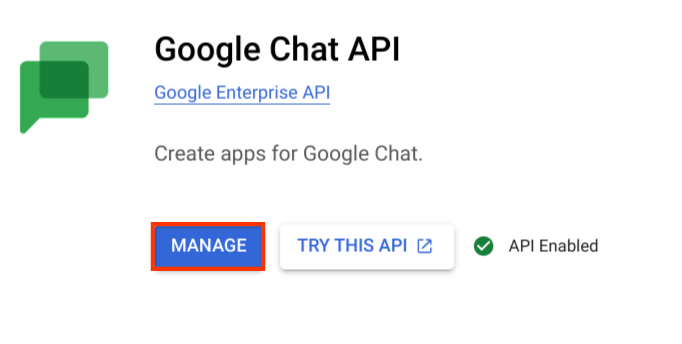
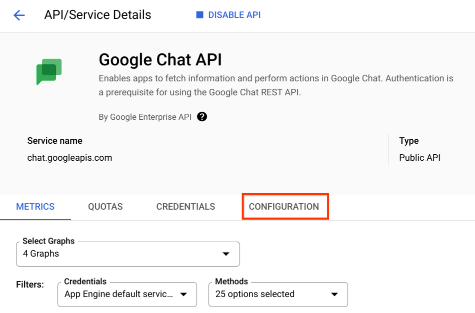
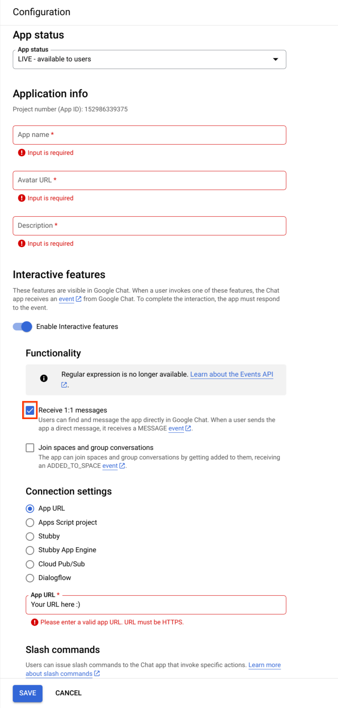
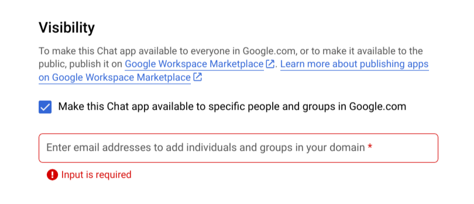

# Google Chat Integration for Dialogflow CX.

## Setup

### Prerequisites

- Follow the instructions on the [main README file](https://github.com/GoogleCloudPlatform/dialogflow-integrations#readme) in the root directory of this repository.
- Create a GCP project and make sure Dialogflow, Google Chat API, and Cloud Functions are enabled.

### Deploying the Integration Using Cloud Run

In your local terminal, change the active directory to this integration's folder.
Run the following command to save the state of your repository into [GCP Container Registry](https://console.cloud.google.com/gcr/). Make sure to uncomment the TODO section in server.js and replace the variables to your corresponding GCP project and Dialogflow Agent. 

```shell
gcloud functions deploy bot --trigger-http --security-level=secure-always --allow-unauthenticated --runtime nodejs18
```

Once your function is deployed you'll get a response something like below 

```shell
buildId: build-id
buildName: projects/project-id/locations/my-location/builds/build-id
entryPoint: bot-name
httpsTrigger:
  securityLevel: SECURE_ALWAYS
  url: https://location.cloudfunctions.net/bot-name
ingressSettings: ALLOW_ALL
labels:
  deployment-tool: cli-gcloud
name: projects/project-id/locations/my-location/functions/bot-name
runtime: nodejs18
serviceAccountEmail: name@appspot.gserviceaccount.com
sourceUploadUrl: https://storage.googleapis.com/file.zip
status: ACTIVE
timeout: 60s
updateTime: '2022'
versionId: '1'

```

Make sure to save the httpsTrigger.url because you'll need this when setting up the google chat bot.

More information can be found in Cloud Function.
[documentation](https://cloud.google.com/functions/docs).

### Setting up Google Chat Bot

From the main GCP Dashboard, search for Google Chat API.


Once located click **MANAGE.**



Then click **CONFIGURATION.**



In configuration you'll be able to give your Chat Bot a name, avatar and description. This information will be visible in Google Chat. 

Once you fill in the Chat bot information get the link that the Google Cloud function was deployed to and set the Bot URL. 



At the bottom of the configuration page, make sure to set the bot's visibility. 



### 
**Testing the Integration**

*   You have now completed all the necessary steps and can test your integration.

*   In a new browser window, open chat.google.com in the same domain as the chatbot user that you specified in the previous step.

*   Next start a new chat and click on **find apps** and type in the name you set your bot to  

*   Now you can directly message your bot and test their responses.
